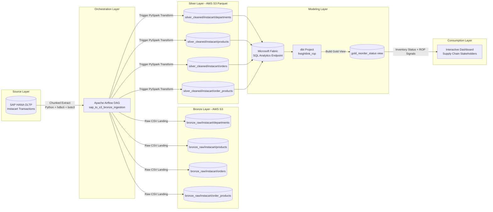

# Freightlink ROP: Dynamic Reorder Point Data Engineering Platform

## 1) Executive Summary

Freightlink ROP is an end-to-end data engineering project designed to support Instacart-like inventory decisions at scale.

It builds a decoupled ELT pipeline that:

1. Extracts high-volume operational data from SAP HANA (OLTP).
2. Lands raw data in AWS S3 Bronze.
3. Transforms 35M+ rows with PySpark into a clean Silver layer.
4. Connects transformed data to Microsoft Fabric.
5. Models business-ready views with dbt in the Gold layer.
6. Powers an interactive dashboard for supply chain stakeholders.

The business focus is Dynamic Reorder Point (ROP), so teams can detect potential stockout risks and prioritize replenishment.

## 2) Problem Statement

### Situation

Instacart operates a massive grocery delivery network with millions of line-item transactions. Regional fulfillment centers must keep products in stock when customers want to reorder. The operational data is stored in a SAP HANA transactional system.

### Complication

The supply chain team needs Dynamic ROP analytics, but running heavy analytical workloads directly on the live OLTP system increases CPU and memory pressure and can impact production application stability.

### Resolution

Build a decoupled, automated batch ELT architecture that moves analytics off the transactional system:

1. SAP HANA -> S3 Bronze
2. Bronze -> Silver using PySpark distributed processing
3. Silver -> Fabric staging
4. dbt models -> Gold business views
5. Dashboard consumption for decision-making

## 3) Business Objective

Provide reliable, near-operational analytics to reduce stockout risk and improve replenishment planning.

Primary business outcomes:

1. Reduce stockouts on high-reorder products.
2. Prioritize replenishment using product-level reorder signals.
3. Protect OLTP system health by offloading analytics to a dedicated platform.

## 4) Architecture Overview

### Data Flow

1. Source (SAP HANA): Operational Instacart tables.
2. Bronze (AWS S3): Raw CSV extracts partitioned by ingestion run.
3. Silver (AWS S3): Typed and compressed Parquet datasets from PySpark.
4. Fabric Staging (SQL endpoint): External/staged tables consumed by dbt.
5. Gold (dbt views): Reorder status model for BI consumption.
6. BI Layer: Interactive dashboard for supply chain users.

### Technical Architecture Diagram

### Medallion Layers

1. Bronze: Immutable raw extracts for traceability and replay.
2. Silver: Cleaned, typed, query-efficient datasets.
3. Gold: Business-friendly models aligned to ROP decisions.

## 5) Technology Stack

1. Orchestration: Apache Airflow
2. Source Connectivity: SAP HANA client (hdbcli)
3. Storage: AWS S3 Data Lake
4. Transformation Engine: PySpark
5. Analytics Modeling: dbt (Fabric adapter)
6. Warehouse/Serving: Microsoft Fabric SQL Analytics endpoint
7. Infrastructure as Code: Terraform
8. Language/Runtime: Python 3.11+

## 6) Repository Structure

1. orchestration/
	- Airflow runtime and DAGs
	- Main pipeline DAG: sap_to_bronze_dag.py
2. scripts/
	- extract_sap_to_bronze.py: standalone SAP -> S3 extraction
	- bronze_to_silver.py: PySpark Bronze -> Silver transform
	- seed_instacart_direct.py: Kaggle dataset seed into SAP HANA
	- clean_s3_instacart.py: cleanup utility for Bronze path
3. dbt/
	- dbt project for Gold modeling
	- gold_reorder_status.sql model + schema tests
4. terraform/
	- S3 data lake, Redshift Serverless, and EC2 Airflow host resources

## 7) Core Dataset and Pipeline Scope

The pipeline handles these core entities:

1. departments
2. products
3. orders
4. order_products (largest fact table)

Extraction is chunked for scale and stability:

1. Default chunk size: 250,000 rows
2. order_products chunk size in DAG: 500,000 rows

## 8) Gold Model: Reorder Decision Signal

Current business model: gold_reorder_status

Model logic:

1. Aggregates total units sold per product.
2. Aggregates total reorder count per product.
3. Joins product and department dimensions.
4. Classifies inventory priority using thresholds:
	- Critical Restock: reordered > 5000
	- Normal Restock: reordered > 1000
	- Stock Sufficient: otherwise

Output fields:

1. product_id
2. product_name
3. department
4. total_units_sold
5. total_times_reordered
6. inventory_status

## 9) Dynamic ROP Concept (Business Layer)

The long-term target is a true Dynamic Reorder Point metric.

Common planning formula:

ROP = (Average Daily Demand x Lead Time in Days) + Safety Stock

How this project supports that:

1. Demand signal: reorder and sales behavior from order_products.
2. Product context: product + department dimensions.
3. Scalable compute: Spark and Fabric/dbt for iterative model refinement.

The current Gold model is a practical reorder-priority baseline and can be extended to full ROP by adding lead-time, service-level, and variability inputs.

## 10) Prerequisites

1. Python 3.11 to <3.13
2. uv (recommended for dependency execution in this repo)
3. AWS account and credentials with S3 access
4. SAP HANA connectivity credentials
5. Microsoft Fabric workspace and SQL endpoint access
6. ODBC Driver 18 for SQL Server (required for dbt Fabric profile)
7. Terraform CLI

## 11) Environment Configuration

Create a root .env file (not committed to source control) with at least:

SAP_HANA_ADDRESS=<your_sap_host>
SAP_HANA_USER=<your_sap_user>
SAP_HANA_PASSWORD=<your_sap_password>
AWS_S3_BUCKET=<your_bucket_name>
AWS_ACCESS_KEY_ID=<your_access_key>
AWS_SECRET_ACCESS_KEY=<your_secret_key>
AWS_DEFAULT_REGION=eu-central-1

Important security note:

1. Do not store real client secrets directly in tracked files.
2. Move Fabric credentials in dbt profiles to environment variables.
3. Rotate any credential that has ever been committed.

## 12) Dependency Installation

From repository root:

uv sync

Or with pip:

pip install -e .

## 13) Infrastructure Provisioning (Terraform)

Working directory: terraform/

1. terraform init
2. terraform plan
3. terraform apply

Provisioned components include:

1. AWS S3 Data Lake bucket with bronze_raw, silver_cleaned, gold_curated prefixes
2. Redshift Serverless namespace/workgroup and IAM role
3. EC2 instance profile + security group for Airflow host pattern

## 14) Execution Runbook

### A) Optional: Seed SAP HANA from Kaggle

From repository root:

uv run python scripts/seed_instacart_direct.py

### B) Extract SAP HANA to S3 Bronze

Standalone mode:

uv run python scripts/extract_sap_to_bronze.py

Airflow mode:

1. Start Airflow in orchestration/: ./start.sh
2. Trigger DAG: sap_to_s3_bronze_ingestion

### C) Transform Bronze to Silver (PySpark)

uv run python scripts/bronze_to_silver.py

In DAG mode, this runs as task: transform_bronze_to_silver_pyspark

### D) Run dbt Gold Models in Fabric

From dbt/:

1. dbt deps
2. dbt run
3. dbt test

Primary model:

1. models/gold_reorder_status.sql

### E) Build Dashboard

Connect BI tooling to the Gold view and expose:

1. Critical Restock products
2. Department-level reorder pressure
3. Top reordered products and trend slices

## 15) Airflow DAG Design

DAG: sap_to_s3_bronze_ingestion

Task graph:

1. extract_departments
2. extract_products
3. extract_orders
4. extract_order_products
5. transform_bronze_to_silver_pyspark (runs after all extracts complete)

Design characteristics:

1. Retry policy: 1 retry, 5-minute delay
2. Chunked extraction to control memory pressure
3. S3 landing path versioned by run date

## 16) Data Quality and Testing

Current dbt tests include:

1. source not_null test on stg_order_products.reordered
2. unique test on gold_reorder_status.product_id
3. not_null test on gold_reorder_status.product_id

Recommended enhancements:

1. Freshness tests on staging sources
2. Accepted values tests for inventory_status
3. Referential integrity tests between products and departments

## 17) Performance and Scalability Notes

1. Extraction is streamed in chunks to avoid large in-memory pulls from SAP.
2. Silver data is stored as Parquet for compressed, analytics-friendly scans.
3. Partitioning strategy is supported in Spark writer function.
4. Heavy aggregations are moved off OLTP onto scalable analytical services.

## 18) Monitoring and Logs

1. Airflow task logs under orchestration/logs/
2. dbt logs under dbt/logs/
3. Query artifacts and compiled SQL under dbt/target/

## 19) Troubleshooting

1. Missing credentials or failed SAP auth:
	- Verify root .env values and network allowlists.
2. S3 access denied:
	- Confirm AWS credentials, region, and bucket policy/role.
3. Spark S3 read/write failures:
	- Verify Hadoop AWS package resolution and local credentials chain.
4. dbt Fabric connection issues:
	- Verify ODBC driver, tenant/client values, and service principal permissions.
5. Airflow DAG import failures:
	- Ensure dependencies are installed in the same runtime environment used by Airflow.

## 20) Security and Governance Guidelines

1. Never commit secrets, tokens, or passwords.
2. Use environment variables or a secret manager for credentials.
3. Restrict IAM permissions to least privilege in production.
4. Limit public network exposure for EC2, Airflow UI, and data services.
5. Add data classification and access policies for sensitive operational data.

## 21) Suggested Roadmap

1. Implement full Dynamic ROP formula with lead-time and safety-stock components.
2. Add incremental processing and change-data-capture patterns.
3. Introduce data contracts and schema drift alerting.
4. Add CI/CD for dbt tests and pipeline validation.
5. Add SLA and anomaly alerting for ingestion and model freshness.

## 22) License and Usage

This repository is intended for educational and portfolio demonstration of data engineering architecture and implementation patterns.