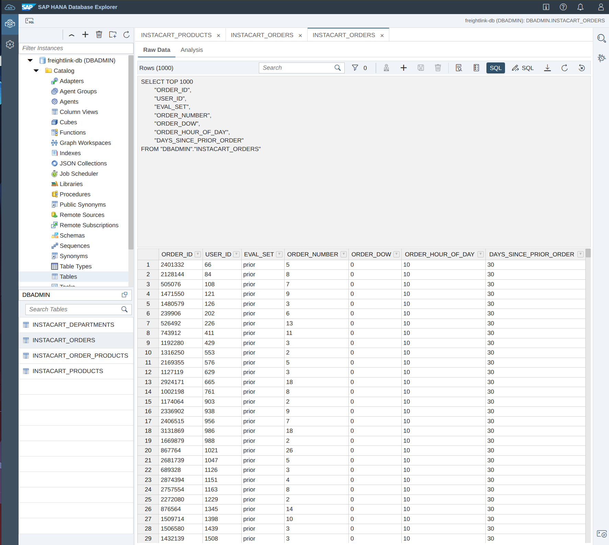
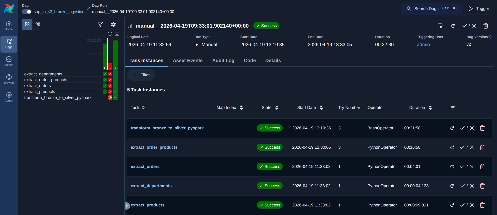
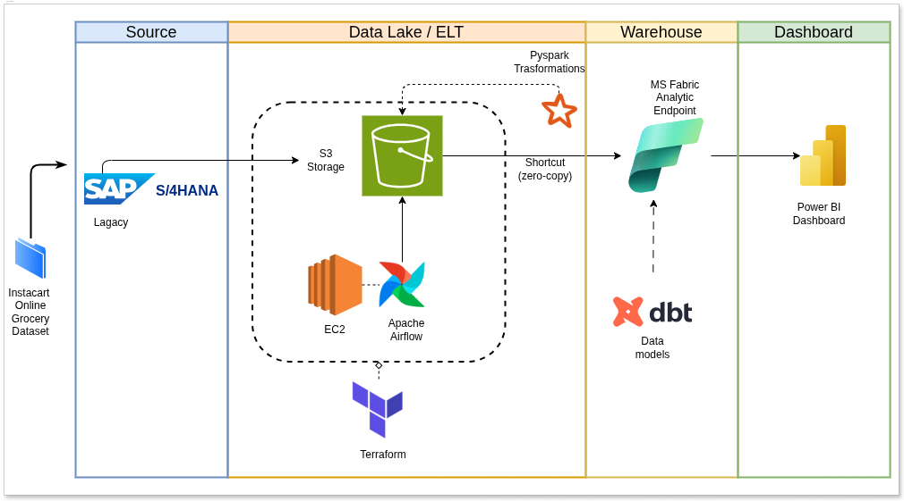
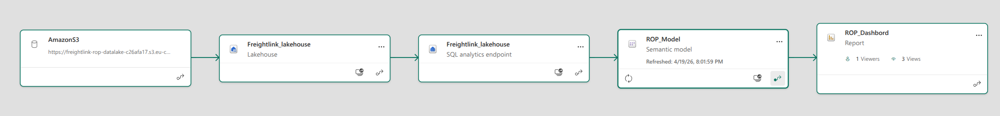
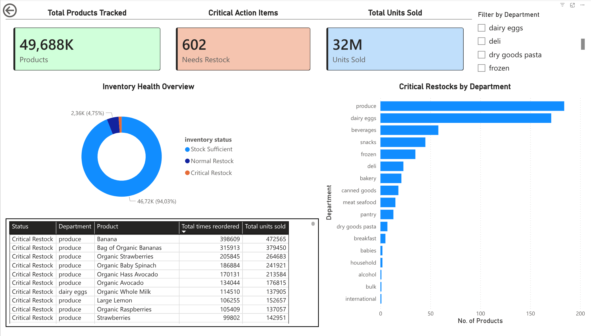

# FreightLink Supply Chain Intelligence
### Multi-Cloud Data Engineering Pipeline using Zero-Copy Architecture

> **Project:** Data Engineering Zoomcamp 2026 Capstone Project
> **Name:** Ridwan Iddris  
> **Role:** Data Engineer / Analytics Engineer 
> **Date:** April 2026
> **Credit:** DataTalks.Club 

---

## 1. Problem Statement (Business Question)

### 1.1 Research-Oriented Business Question

FreightLink addresses the following operational analytics question:

> **How can a supply chain organization reduce inventory stockout risk by building a scalable, cloud-native analytics pipeline that offloads heavy analytical workloads from SAP transactional systems while preserving data fidelity and governance?**

The business context reflects an Instacart-like environment where high-volume order activity creates significant pressure on replenishment planning. Directly executing analytical workloads on OLTP infrastructure increases risk to application performance and production reliability. This project therefore investigates a decoupled architecture for near-operational decision support.

### 1.2 Scope and Constraints

**Scope**

- Source domain: Grocery retail order lifecycle (departments, products, orders, order_products).
- Data source: Kaggle Instacart dataset used to simulate SAP HANA transactional behavior.
- Pipeline objective: Extract, transform, model, and serve reorder intelligence to business stakeholders.

**System Constraints**

- Analytical processing must not degrade transactional SAP performance.
- Pipeline must support large-table chunked extraction (tens of millions of records).
- Architecture must remain cloud-portable and auditable across AWS and Microsoft Fabric.
- Transformations must produce repeatable, testable outputs with model-level quality checks.


*Figure 1: Simulated SAP HANA raw transactional data source.*

---

## 2. Methodology (Phases)

The implementation follows a staged engineering methodology aligned with Medallion principles and production-grade orchestration.

### Phase 1: Extraction (SAP to Bronze)

Raw operational tables are extracted from SAP HANA and landed to AWS S3 Bronze as immutable raw files. Orchestration is implemented with Apache Airflow hosted and executed on an **AWS EC2 instance** provisioned through **Terraform**. This phase applies chunked ingestion controls to maintain extraction reliability on large fact tables.


*Figure 2: Successful execution of the Apache Airflow extraction pipeline on AWS EC2.*

### Phase 2: Transformation (Bronze to Silver)

Bronze datasets are transformed with PySpark into typed, cleaned, analytics-ready Silver Parquet tables. This phase standardizes schema consistency, improves scan performance, and prepares high-quality inputs for downstream semantic modeling.

### Phase 3: Modeling (Silver to Gold)

Silver outputs are consumed in Microsoft Fabric and transformed with dbt into governed Gold models, including the `gold_reorder_status` business model. Tests (e.g., `not_null`, `unique`) enforce contract-level quality expectations for reporting readiness.

### Phase 4: Semantic Consumption (Gold to Decision Layer)

Gold models are exposed via a Power BI semantic layer to produce an operational command center focused on reorder pressure, high-risk products, and department-level replenishment priorities.

---

## 3. System Architecture and Lineage


*Figure 3: End-to-end Zero-Copy Data Lakehouse Architecture.*

FreightLink adopts a Medallion architecture to separate concerns across ingestion, transformation, and business semantics:

- **Bronze:** Immutable, raw landing zone from SAP extraction.
- **Silver:** Curated and optimized transformation layer (PySpark Parquet outputs).
- **Gold:** Business-facing analytics models (dbt in Fabric).

The architecture applies an S3-to-Fabric **Shortcut pattern** to support zero-copy analytics behavior, minimizing unnecessary data duplication while preserving a governed transformation path.

Microsoft Fabric further provides semantic observability by tracking model dependencies from staged sources through dbt models to final reporting artifacts. This lineage layer improves trust, explainability, and change-impact analysis for engineering and analytics teams.


*Figure 4: Automated end-to-end data lineage tracked natively within Microsoft Fabric.*

---

## 4. Evaluation and Final Product

The final product is a Power BI semantic model and dashboard that operationalizes the project research question into decision-ready metrics. Specifically, the model consolidates reorder behavior, product context, and department-level pressure into interpretable inventory status signals (e.g., critical restock, normal restock, sufficient stock). This allows supply chain teams to prioritize replenishment actions with higher confidence while preserving OLTP stability through analytical workload separation.

In evaluation terms, FreightLink demonstrates that a zero-copy, multi-cloud data engineering pattern can:

- Reduce analytical dependency on transactional SAP systems.
- Improve traceability from ingestion to semantic consumption.
- Deliver business-facing stockout intelligence with governed transformation quality.


*Figure 5: The FreightLink Supply Chain Command Center dashboard.*

---

## 5. Technology Stack

| Component | Technology | Rationale |
|---|---|---|
| Source System | SAP HANA (simulated via Kaggle Instacart data) | Represents enterprise-grade transactional ERP/OLTP behavior for realistic ingestion design. |
| Workflow Orchestration | Apache Airflow | Schedules, monitors, and retries extraction/transformation tasks with DAG-level control. |
| Compute Host | AWS EC2 | Runs the Airflow runtime in a controllable cloud VM environment. |
| Infrastructure as Code | Terraform | Provisions reproducible cloud infrastructure (EC2, storage, and supporting resources). |
| Raw Data Lake Layer | AWS S3 (Bronze) | Durable, low-cost object storage for immutable raw extracts. |
| Curated Data Lake Layer | AWS S3 (Silver Parquet) | Columnar storage optimized for downstream analytics and efficient query scans. |
| Distributed Processing | PySpark | Scales transformation workloads across high-volume transactional data. |
| Transformation and Testing | dbt (Fabric adapter) | Delivers SQL-based modular modeling with schema tests and lineage-aware DAGs. |
| Serving and Semantic Layer | Microsoft Fabric SQL Endpoint + Semantic Model | Enables governed business consumption and model-driven analytics. |
| BI and Decision Interface | Power BI | Provides stakeholder-facing dashboards for inventory and reorder intelligence. |
| Programming Language | Python 3.11+ | Core language for extraction scripts, orchestration logic, and utility workflows. |

---

## 6. Project Structure

```text
freightlink-rop/
|-- README.md
|-- pyproject.toml
|-- airflow.cfg
|-- main.py
|-- scripts/
|   |-- extract_sap_to_bronze.py
|   |-- bronze_to_silver.py
|   |-- seed_instacart_direct.py
|   `-- clean_s3_instacart.py
|-- orchestration/
|   |-- start.sh
|   |-- airflow.cfg
|   |-- dags/
|   |   `-- sap_to_bronze_dag.py
|   `-- logs/
|-- dbt/
|   |-- dbt_project.yml
|   |-- profiles.yml
|   |-- models/
|   |   |-- gold_reorder_status.sql
|   |   `-- schema.yml
|   |-- logs/
|   `-- target/
|-- terraform/
|   |-- main.tf
|   |-- compute.tf
|   |-- redshift.tf
|   `-- variables.tf
|-- images/
|   |-- architecture.jpg
|   |-- SAP-data-Explorer2.jpg
|   |-- Aiflow-workflow-success.png
|   |-- Microsoft-fabric-lineage.png
|   `-- Dashboard.jpg
`-- logs/
```

---

## 7. Installation and Usage

### 6.1 Prerequisites

- Python `3.11` to `<3.13`
- `uv` (recommended) or `pip`
- AWS credentials with S3 access
- SAP HANA credentials and network connectivity
- Microsoft Fabric workspace + SQL endpoint access
- ODBC Driver 18 for SQL Server (dbt Fabric connectivity)
- Terraform CLI

### 6.2 Setup

1. Install dependencies from project root.

```bash
uv sync
```

Alternative:

```bash
pip install -e .
```

2. Configure environment variables in `.env` at repository root.

```bash
SAP_HANA_ADDRESS=<your_sap_host>
SAP_HANA_USER=<your_sap_user>
SAP_HANA_PASSWORD=<your_sap_password>
AWS_S3_BUCKET=<your_bucket_name>
AWS_ACCESS_KEY_ID=<your_access_key>
AWS_SECRET_ACCESS_KEY=<your_secret_key>
AWS_DEFAULT_REGION=eu-central-1
```

3. Provision cloud infrastructure.

```bash
cd terraform
terraform init
terraform plan
terraform apply
```

### 6.3 Execution

1. Optional seed operation (Kaggle -> SAP simulation).

```bash
uv run python scripts/seed_instacart_direct.py
```

2. Start Airflow orchestration.

```bash
cd orchestration
./start.sh
```

3. Trigger DAG `sap_to_s3_bronze_ingestion` in the Airflow UI.

4. Run standalone transformation (if needed outside DAG).

```bash
cd ..
uv run python scripts/bronze_to_silver.py
```

5. Execute dbt build flow.

```bash
cd dbt
dbt deps
dbt run
dbt test
```

---

## Appendix: Governance and Extension Path

> **Governance Note:** Secrets should never be committed to source control. Move all credentials to environment variables or a managed secret service for production use.

Future extension to a full Dynamic ROP model can incorporate lead time variability, service-level targets, and safety stock estimation to implement:

$$
ROP = (Average\ Daily\ Demand \times Lead\ Time) + Safety\ Stock
$$

This foundation positions FreightLink for production evolution into near-real-time replenishment intelligence.